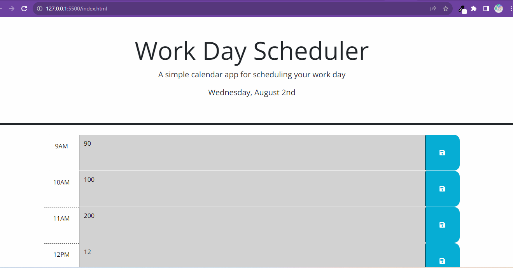

# 05 Third-Party APIs: Work Day Scheduler

## Description

Create a simple calendar application that allows a user to save events for each hour of a typical working day (9am&ndash;5pm) by modifying starter code. This app will run in the browser and feature dynamically updated HTML and CSS powered by jQuery.

You'll need to use the [Day.js](https://day.js.org/en/) library to work with date and time. Be sure to read the documentation carefully and concentrate on using Day.js in the browser.

## User Story

```md
AS AN employee with a busy schedule
I WANT to add important events to a daily planner
SO THAT I can manage my time effectively
```

## Acceptance Criteria

```md
GIVEN I am using a daily planner to create a schedule
WHEN I open the planner
THEN the current day is displayed at the top of the calendar
WHEN I scroll down
THEN I am presented with timeblocks for standard business hours of 9am&ndash;5pm
WHEN I view the timeblocks for that day
THEN each timeblock is color coded to indicate whether it is in the past, present, or future
WHEN I click into a timeblock
THEN I can enter an event
WHEN I click the save button for that timeblock
THEN the text for that event is saved in local storage
WHEN I refresh the page
THEN the saved events persist
```
## Motivation

I was motivated to do this project in order to further my skills and education in Javascript & Jquery including 3rd party API's and storing/transmiting data from local storage. I was also motivated to create a useful app that I could use in my day to day life.

## Why 

I created this project because I wanted to create a simple app that would allow me to plan my day and save my plans to local storage. I also wanted to create a simple app that would allow me to practice using 3rd party API's and Jquery.

## What problem does it solve?

This app solves the problem of not having a simple way to plan your day and save your plans to local storage.

## What did you Learn?

I learned how to use 3rd party API's and Jquery/javascript to create a simple app that allows you to plan your day and save your plans to local storage.

## what makes this project stand out?

This project stands out to me because its the first time I have strung all these new methods, jquery, & DOM's into one page. It is a simple app that tested my new skill and allows you to plan your day and save your plans to local storage.

## You can view a mockup of my project below:



### Link to githubrepo:

https://github.com/precisecoding/challeng5calander

### Deployed link:

https://precisecoding.github.io/challeng5calander/

### This site was build using github pages.

https://pages.github.com/

### License

MIT License: 
https://opensource.org/licenses/MIT 
https://choosealicense.com/licenses/mit/ 
LICENSE file included in repository.

### Thanks to everyone for support and contributions!

Sources used: https://developer.mozilla.org/en-US/, https://www.w3schools.com/, https://stackoverflow.com/. Worked with TA George Yoo while on writing the pseudo code, once again he was very helpful.